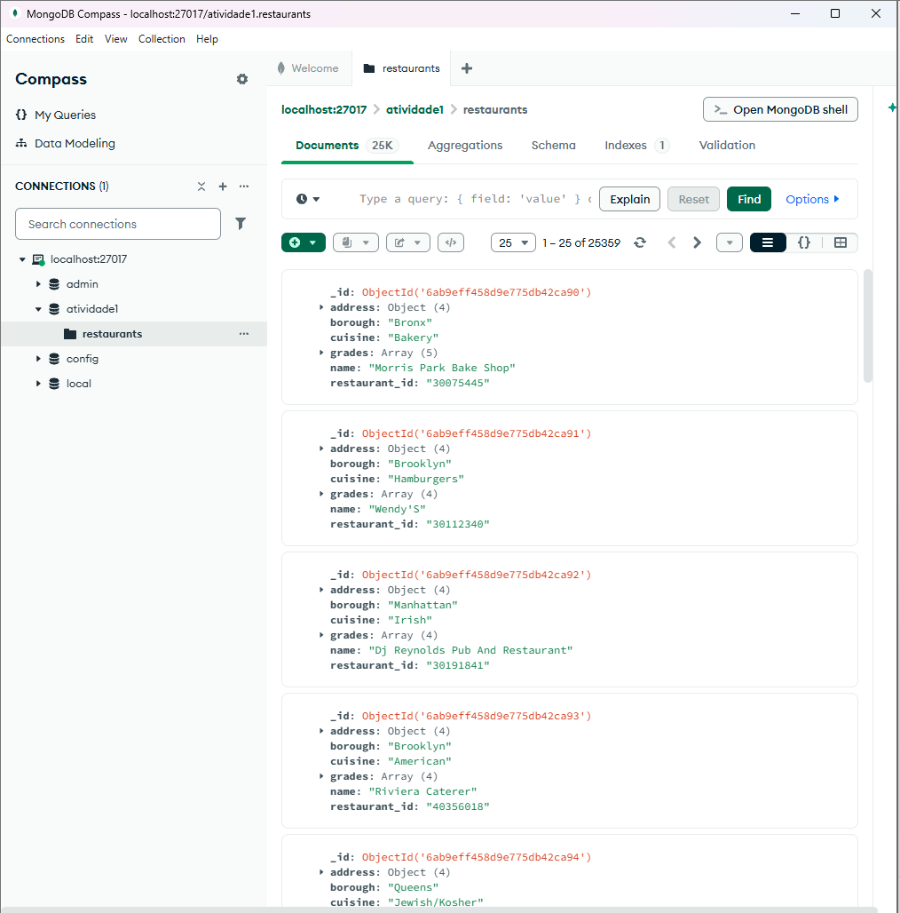

# Atividade 1 — Consultas no MongoDB

Importação de um conjunto de 25.359 restaurantes de Nova York e consultas com filtros no `mongosh`.

- **Etapa 1:** importação do `restaurantes.json` no banco `atividade1`, coleção `restaurants`
- **Etapa 2:** inserção de um restaurante novo (`insertOne`)
- **Etapa 3:** buscas simples (bairro, CEP, nota)
- **Etapa 4:** buscas com operadores (`$gt`, `$lt`, `$and`, `$or`)

Os comandos estão em [comandos.txt](comandos.txt) e os resultados na pasta [prints](prints).

