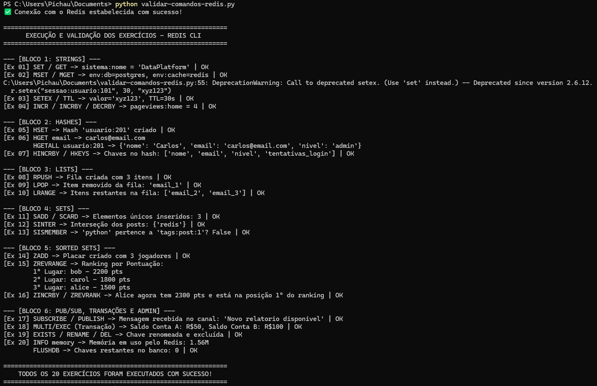

# Lista 01 — Exercícios com o Redis

20 exercícios no terminal do Redis (Memurai no Windows), passando por todos os tipos principais:

- **Strings:** SET, GET, MSET, MGET, SETEX, TTL, INCR, INCRBY, DECRBY
- **Hashes:** HSET, HGET, HGETALL, HINCRBY, HKEYS
- **Lists:** RPUSH, LPOP, LRANGE
- **Sets:** SADD, SCARD, SINTER, SISMEMBER
- **Sorted Sets:** ZADD, ZREVRANGE, ZINCRBY, ZREVRANK
- **Pub/Sub, transação e administração:** SUBSCRIBE, PUBLISH, MULTI/EXEC, EXISTS, RENAME, DEL, INFO, FLUSHDB

Os comandos estão em [comandos.txt](comandos.txt). No final, o script [validar-comandos-redis.py](validar-comandos-redis.py) roda os 20 exercícios em Python e confere cada um:

```bash
python -m pip install redis
python validar-comandos-redis.py
```


