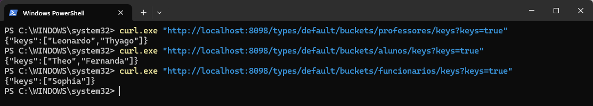

# Atividade 2 — Riak

Riak KV rodando no Docker, usando a API HTTP (porta 8098) pelo PowerShell com o `curl.exe`.

- **Etapa 1:** insere 6 pessoas (chave = nome, valor = idade) nos buckets `professores`, `alunos` e `funcionarios` e lista as chaves de cada um.
- **Etapa 2:** muda a idade do Theo pra 25, passa o Leonardo de `funcionarios` pra `professores`, apaga o Afonso, mostra a idade nova do Theo e lista as chaves de novo.

Os comandos estão em [comandos.txt](comandos.txt), e o PDF entregue é o [Atividade2_Riak.pdf](Atividade2_Riak.pdf).

## Como rodar

Com o Docker Desktop aberto:

```
docker run -d --name riak -p 8087:8087 -p 8098:8098 basho/riak-kv
curl.exe http://localhost:8098/ping
```

Depois é só rodar os comandos do `comandos.txt`.


