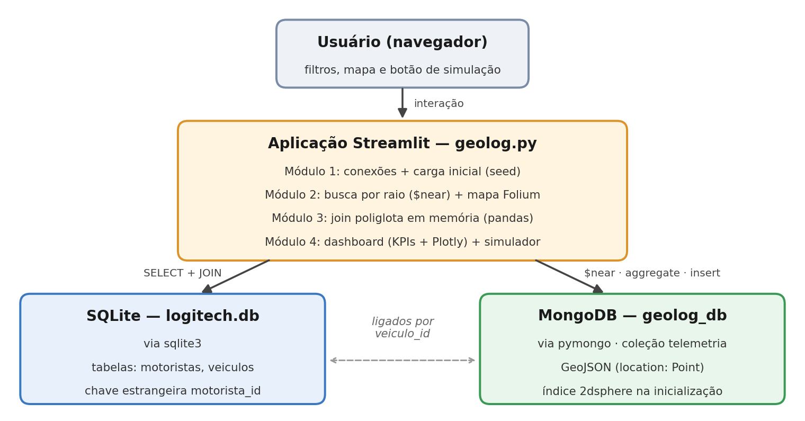
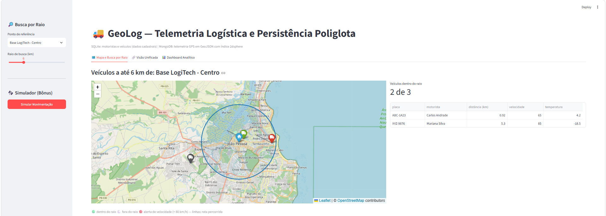

# Desafio GeoLog — Telemetria logística e persistência poliglota

Plataforma para acompanhar os caminhões de uma transportadora em João Pessoa, num único arquivo Streamlit (`geolog.py`):

- **SQLite (`logitech.db`):** motoristas e veículos
- **MongoDB (`geolog_db.telemetria`):** posições GPS em GeoJSON, temperatura e velocidade, com índice 2dsphere criado na inicialização
- **Busca por raio** com `$near` e mapa interativo (Folium)
- **Visão unificada** juntando os dois bancos pelo `veiculo_id`
- **Dashboard** com indicadores e gráficos (Plotly)
- **Bônus:** botão "Simular Movimentação", que gera novas posições e atualiza tudo na hora

```bash
python -m streamlit run geolog.py
```




O relatório técnico está em [Relatorio_GeoLog.pdf](Relatorio_GeoLog.pdf).
