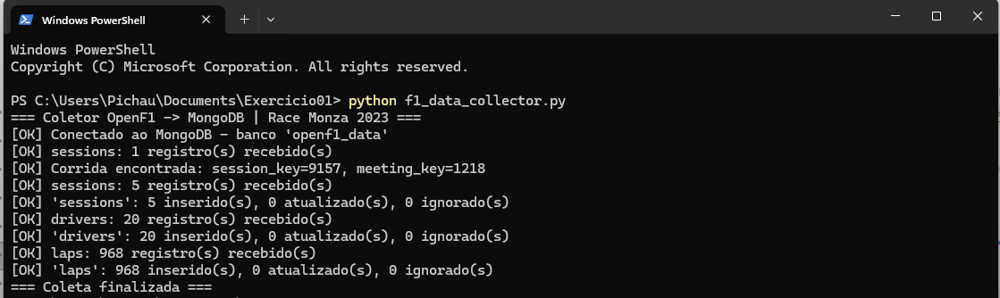
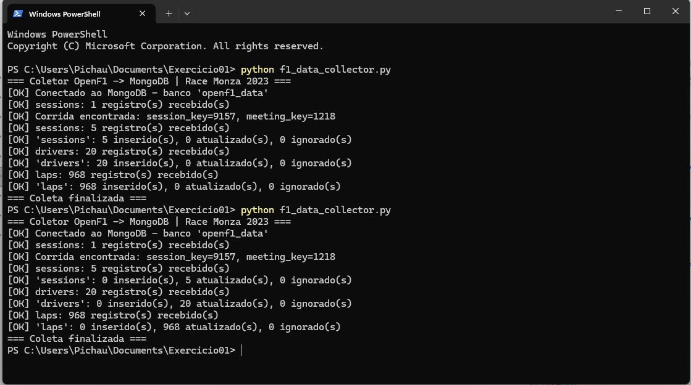

# Exercício 01 — Coletor OpenF1 → MongoDB

Script que busca na API [OpenF1](https://openf1.org) as sessões, os pilotos e as voltas do **GP da Itália 2023 (Monza)** e salva no MongoDB (banco `openf1_data`), sem duplicar dados: cada registro é gravado com `update_one(..., upsert=True)` usando uma chave única.

> O enunciado cita `session_key=9159` e `meeting_key=1219`, mas esses números são do GP de Singapura. Por isso o script procura a corrida pelo ano, circuito e nome da sessão (`2023`, `Monza`, `Race`).

```bash
python f1_data_collector.py
```

| Primeira execução | Segunda execução (não duplica) |
|---|---|
|  |  |
