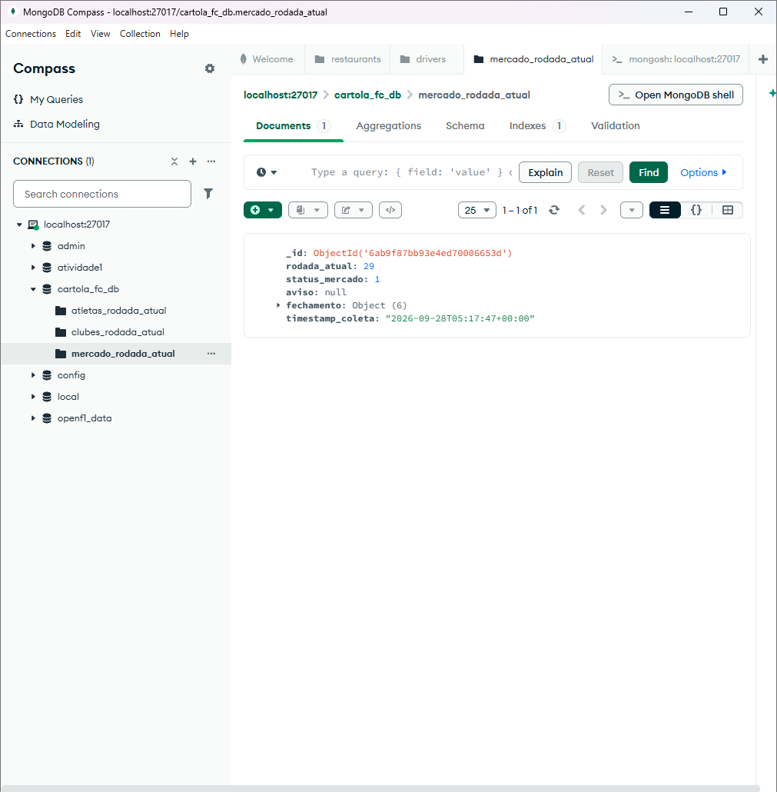

# Exercício 2 — ETL do Cartola FC → MongoDB

Busca os dados do mercado do Cartola FC e grava no banco `cartola_fc_db`:

- `clubes_rodada_atual`: clubes, atualizados sem duplicar (upsert pelo id)
- `atletas_rodada_atual`: jogadores, trocados a cada coleta, com a data e hora
- `mercado_rodada_atual`: rodada atual e situação do mercado

A situação do mercado vem de `/mercado/status`, porque esses campos não aparecem em `/atletas/mercado`.

```bash
python cartola_etl.py
```


