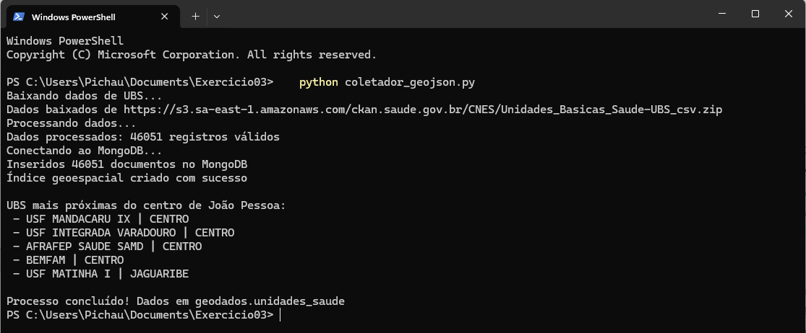
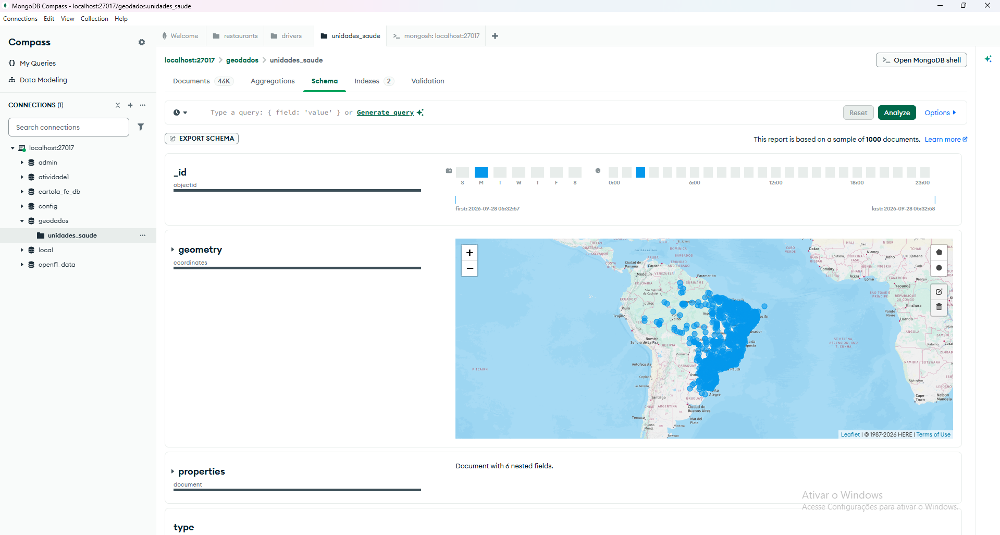

# Exercício 03 — Georreferenciamento com MongoDB e GeoJSON

Baixa a lista de Unidades Básicas de Saúde (UBS) dos dados abertos do Ministério da Saúde, converte cada posto para **GeoJSON** e salva no banco `geodados`, coleção `unidades_saude`, com índice **2dsphere**. No final, mostra os 5 postos mais perto do Centro de João Pessoa usando `$near`.

```bash
python coletador_geojson.py
```



