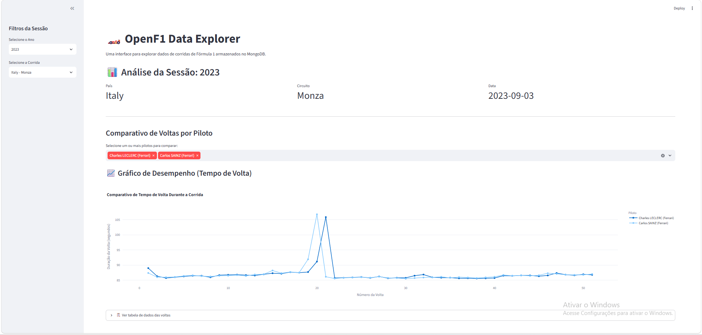

# Prática 04 — OpenF1 Data Explorer (Streamlit)

Página web que lê os dados salvos no Exercício 01 e mostra, para a corrida escolhida, o país, o circuito e a data, além de um gráfico comparando o tempo de cada volta dos pilotos selecionados e a tabela com os números.

```bash
python -m streamlit run streamlit_app.py
```


