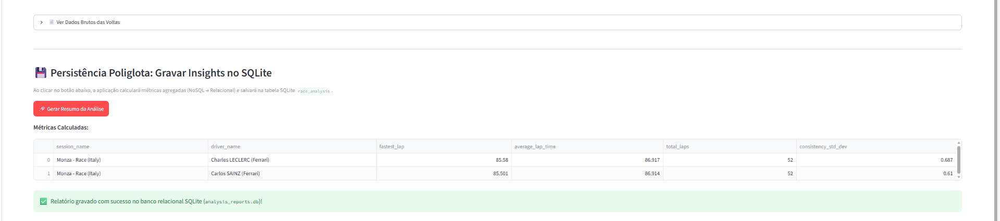

# Prática 05 — Persistência poliglota (MongoDB + SQLite)

Continuação da Prática 04. Além de ler as voltas no **MongoDB**, a página calcula um resumo de cada piloto (volta mais rápida, tempo médio, total de voltas e regularidade) e salva no **SQLite** (`analysis_reports.db`, tabela `race_analysis`). A aba "Histórico de Análises" lê esses resumos do SQLite.

```bash
python -m streamlit run streamlit_app.py
```


